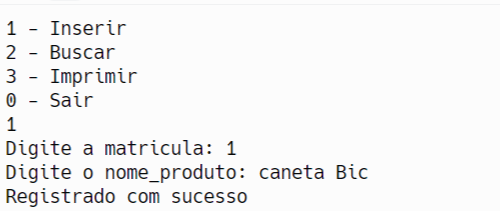
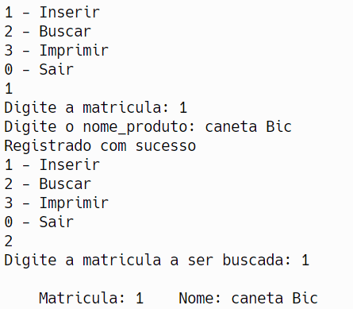
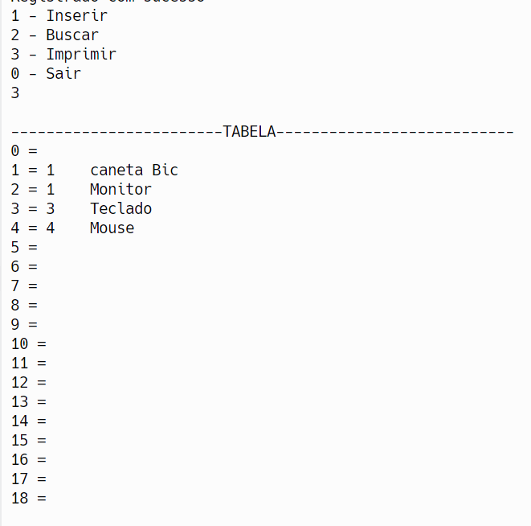
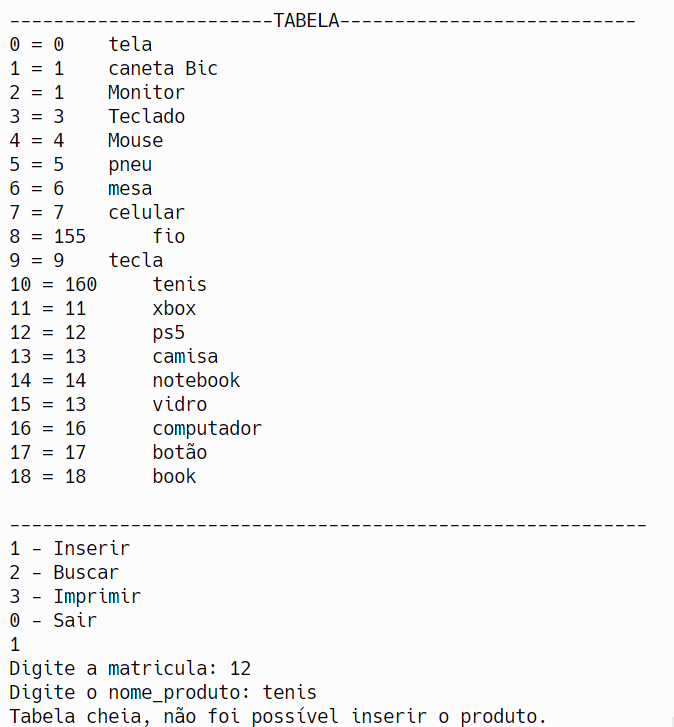

# Distributed-Hash-Table

# Casos de Teste para Tabela Hash Distribuída (DHT) - Atividade Ponderada

## 1. Testar Inserção

### Pré-condição
- A tabela hash deve estar inicializada e não completamente cheia.

### Etapas do Teste
1. Inicialize a tabela hash.
2. Insira um produto com uma matrícula e nome específicos.

### Pós-condição
- O produto deve ser adicionado à tabela hash no índice correto, baseado na função de hash da matrícula.

### Resultado
Teste aprovado.

## 2. Testar Busca

### Pré-condição
- A tabela hash contém pelo menos um produto inserido previamente.

### Etapas do Teste
1. Busque por um produto usando uma matrícula existente na tabela.

### Pós-condição
- O sistema deve encontrar o produto e exibir suas informações corretamente.

### Resultado
Teste aprovado.

## 3. Testar Impressão

### Pré-condição
- A tabela hash contém vários produtos inseridos.

### Etapas do Teste
1. Execute a função de impressão para listar todos os produtos na tabela hash.

### Pós-condição
- Todos os produtos inseridos na tabela hash devem ser impressos na tela, com índices corretos e informações completas.

### Resultado
Teste aprovado.

## 4. Testar Colisão

### Pré-condição
- A tabela hash contém pelo menos um produto, e o próximo produto a ser inserido tem uma matrícula que gera o mesmo índice hash do produto já inserido.

### Etapas do Teste
1. Insira um produto que cause uma colisão no índice gerado pela função de hash.

### Pós-condição
- A função de inserção deve tratar a colisão corretamente, inserindo o novo produto na próxima posição disponível.

### Resultado
Teste aprovado.

## 5. Testar Tabela Cheia

### Pré-condição
- A tabela hash está completamente cheia, com todos os índices ocupados.

### Etapas do Teste
1. Tente inserir um novo produto na tabela hash.

### Pós-condição
- O sistema deve detectar que a tabela está cheia e exibir uma mensagem indicando que não é possível inserir mais produtos.

### Resultado
Teste aprovado.

## Referências
Works Cited“Curso de Programação c | Como Implementar Uma TABELA HASH Com Vetor Na Prática? | Aula 260.” Www.youtube.com, 21 Feb. 2024, www.youtube.com/watch?v=N4uQ6oq0VVc. Accessed 22 Feb. 2024.

"#1 Solidity Tutorial & Ethereum Blockchain Programming Course | CryptoZombies.” Cryptozombies.io, 21 Feb. 2024, cryptozombies.io/pt/lesson/1/chapter/1. Accessed 22 Feb. 2024.